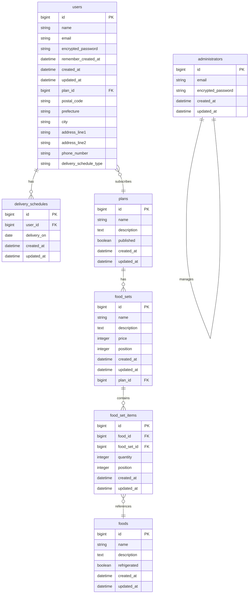

```mermaid
erDiagram
  administrators ||--|| administrators : manages
  users ||--o{ delivery_schedules : has
  users }o--|| plans : subscribes
  plans ||--o{ food_sets : has
  food_sets ||--o{ food_set_items : contains
  food_set_items }o--|| foods : references

  administrators {
    bigint id PK
    string email
    string encrypted_password
    datetime created_at
    datetime updated_at
  }

  users {
    bigint id PK
    string name
    string email
    string encrypted_password
    datetime remember_created_at
    datetime created_at
    datetime updated_at
    bigint plan_id FK
    string postal_code
    string prefecture
    string city
    string address_line1
    string address_line2
    string phone_number
    string delivery_schedule_type
  }

  delivery_schedules {
    bigint id PK
    bigint user_id FK
    date delivery_on
    datetime created_at
    datetime updated_at
  }

  plans {
    bigint id PK
    string name
    text description
    boolean published
    datetime created_at
    datetime updated_at
  }

  food_sets {
    bigint id PK
    string name
    text description
    integer price
    integer position
    datetime created_at
    datetime updated_at
    bigint plan_id FK
  }

  food_set_items {
    bigint id PK
    bigint food_id FK
    bigint food_set_id FK
    integer quantity
    integer position
    datetime created_at
    datetime updated_at
  }

  foods {
    bigint id PK
    string name
    text description
    boolean refrigerated
    datetime created_at
    datetime updated_at
  }

```
